# 🎬 Canvas Scroll Sequence Animation


A smooth **scroll-controlled image sequence animation** built using **React, GSAP ScrollTrigger, and HTML Canvas**.

This project converts hundreds of image frames into a cinematic scrolling experience where the user controls the animation progress through scrolling.

The animation is rendered completely on an HTML Canvas for better performance instead of using a video element.

---

# 📸 Preview


## 🚀 Initial Frame

The first frame rendered on the canvas after all images are preloaded.

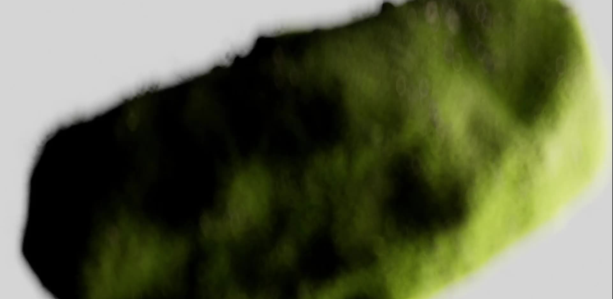

---


## 🎞️ Middle Animation Frame

A frame captured while scrolling through the animation sequence.

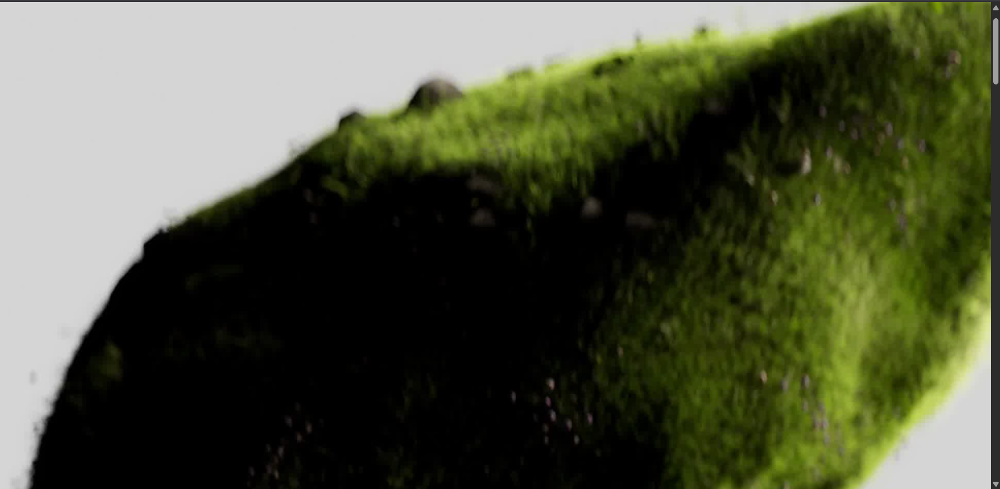
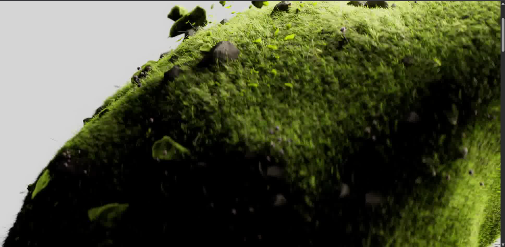
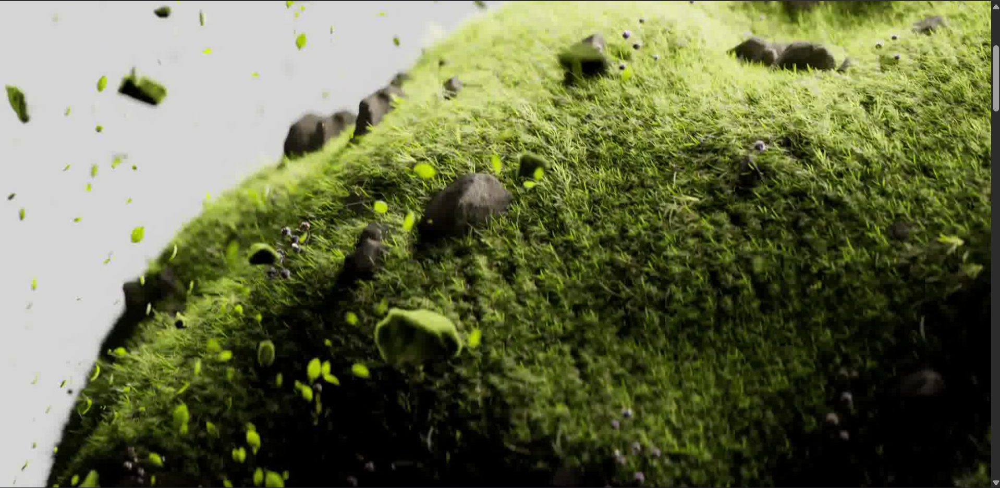


---
## 🎞️ Middle Animation Frame 2

A frame captured while scrolling through the animation sequence.

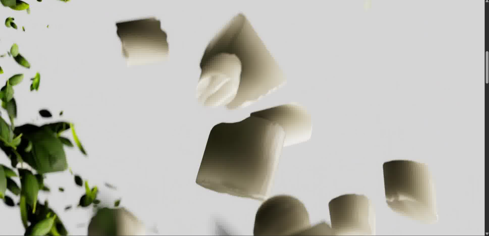
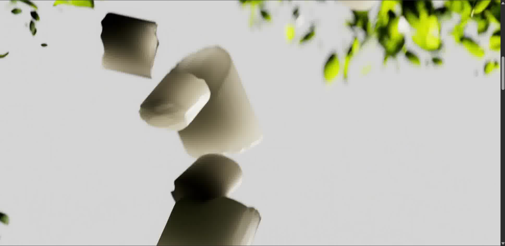
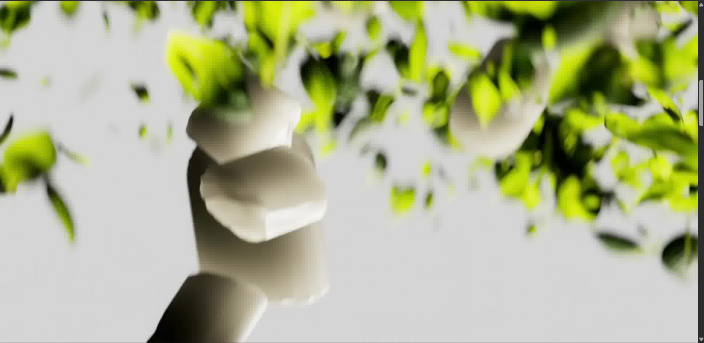

---
## 🎞️ Middle Animation Frame 3

A frame captured while scrolling through the animation sequence.

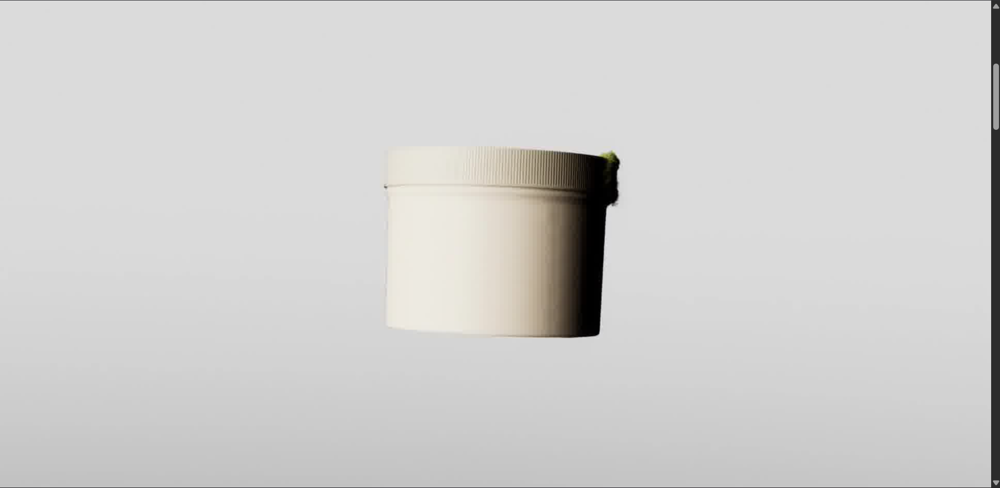
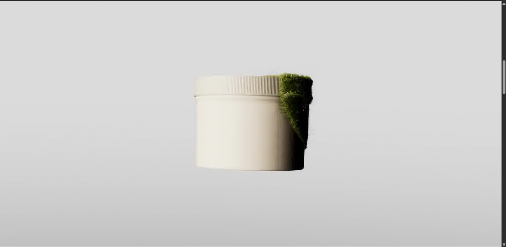
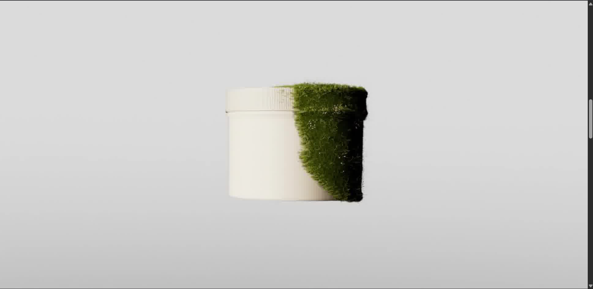
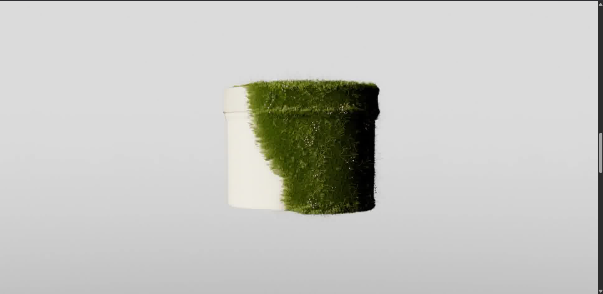
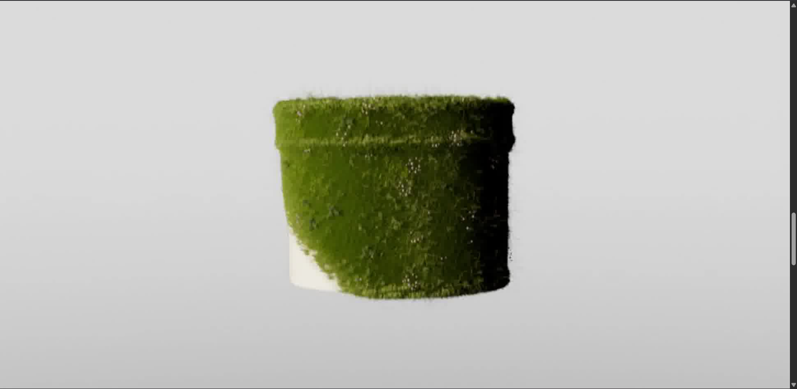
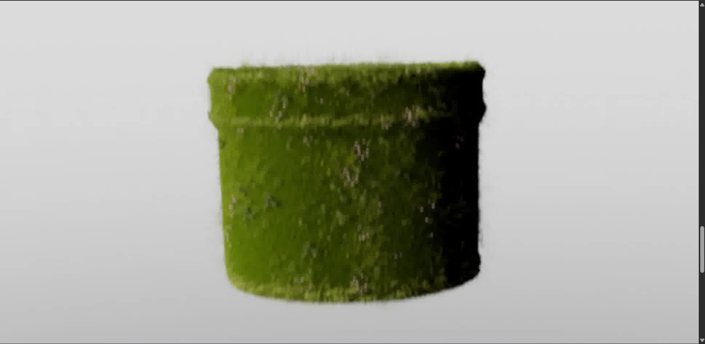

---


## 🏁 Final Animation Frame

The ending frame of the scroll-controlled sequence.

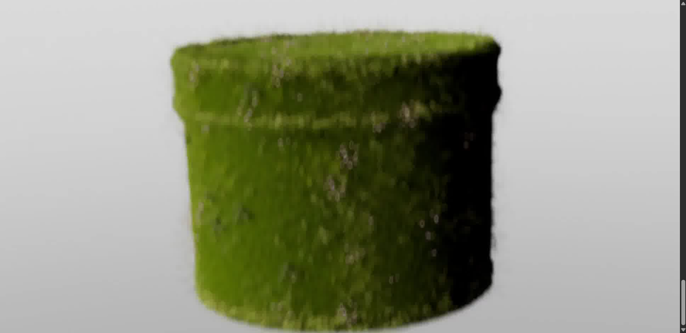


---

# ✨ Features


## 🖼️ Canvas Image Sequence Rendering

- Renders hundreds of images as animation frames
- Uses HTML Canvas API for smooth playback
- Dynamically updates frames during scroll
- Provides video-like animation without using video files
- Maintains high image quality


---


## 🎬 GSAP ScrollTrigger Animation

- Scroll based animation control
- Smooth scrub effect
- Timeline driven animation
- Sticky canvas section
- Frame-by-frame progress control


---


## ⚡ Image Preloading System

Before starting the animation:

- All image frames are loaded
- Loading progress is tracked
- Animation starts only after assets are ready
- Prevents missing or flickering frames


---


## 📱 Responsive Canvas Scaling

Canvas automatically:

- Covers the full viewport
- Maintains image aspect ratio
- Calculates proper scaling
- Centers every frame perfectly


---


## ⚛️ Optimized React Architecture

- React functional components
- useRef for animation data
- useState for loading state
- useEffect for initialization
- Prevents unnecessary re-renders during animation


---

# 🧠 How It Works


```text
React Component Mounts

        ↓

Preload Image Frames

        ↓

Store Images Inside useRef

        ↓

Draw First Frame On Canvas

        ↓

Initialize GSAP ScrollTrigger

        ↓

User Starts Scrolling

        ↓

GSAP Updates Current Frame Index

        ↓

Canvas Clears Previous Frame

        ↓

New Image Frame Gets Rendered

        ↓

Smooth Scroll Animation
```

---

# 🛠️ Tech Stack


| Technology | Purpose |
|-----------|---------|
| React | Frontend Framework |
| Vite | Development Setup |
| GSAP | Animation Engine |
| ScrollTrigger | Scroll Based Control |
| HTML Canvas | Image Rendering |
| Tailwind CSS | Styling |
| JavaScript ES6 | Application Logic |


---

# 📂 Project Structure


```text
canvas-scroll-sequence-animation

│
├── public/
│
│   └── ImageFrames/
│       ├── frame_0001.jpeg
│       ├── frame_0002.jpeg
│       ├── frame_0003.jpeg
│       └── ...
│

├── screenshots/
│
│   ├── animation-demo.gif
│   ├── first-frame.png
│   ├── middle-frame.png
│   └── final-frame.png
│

├── src/
│
│   ├── components/
│   │
│   │   └── Canvas.jsx
│
│   ├── App.jsx
│   ├── main.jsx
│   └── index.css

│
├── package.json
├── vite.config.js
└── README.md
```

---

# ⚙️ Installation


Clone the repository


```bash
git clone https://github.com/pratiklachwani7-prog/canvas-scroll-sequence-animation.git
```


Open project folder


```bash
cd canvas-scroll-sequence-animation
```


Install dependencies


```bash
npm install
```


Start development server


```bash
npm run dev
```


---

# 🔥 Main Animation Logic


GSAP controls only the frame number:


```javascript
gsap.to(frames.current, {

    currentIndex: frames.current.maxIndex,

    scrollTrigger:{
        trigger: ".parentCanvas",
        scrub: 2
    },

    onUpdate: () => {

        loadImg(
            Math.floor(
                frames.current.currentIndex
            )
        );

    }

});
```


Canvas handles the rendering:


```javascript
ctx.drawImage(
    image,
    x,
    y,
    width,
    height
);
```


This separation keeps the animation smooth because React does not re-render hundreds of times.

---

# 📚 Concepts Learned

Through this project I practiced:

- HTML Canvas Rendering
- Image Sequence Animation
- GSAP ScrollTrigger
- Scroll Based Storytelling
- React useRef Optimization
- Image Preloading
- Frame Management
- Canvas Scaling Algorithms
- Smooth Animation Techniques
- Creative Frontend Development


---

# 🚀 Future Improvements

- Add loading percentage UI
- Add more scroll sections
- Improve mobile responsiveness
- Add transition effects
- Optimize image compression
- Add lazy frame loading


---

# ⭐ Support

If you liked this project, consider giving the repository a ⭐.

---

# 👨‍💻 Author

**Pratik Lachwani**

Frontend Developer interested in React, GSAP, animations, and creative web experiences.
